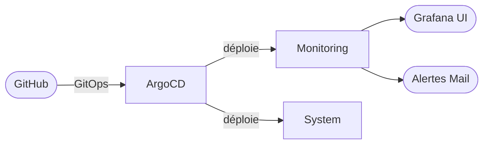

# Homelab Monitoring Stack

     

Stack d'observabilité GitOps déployée sur K3s, supervisée par _Argo CD_ et basée sur `kube-prometheus-stack`.

### Prérequis à la lecture

Ce projet suppose une familiarité avec :
- Les bases de Kubernetes (pods, services, namespaces)
- Git et les principes de versioning
- La ligne de commande Linux

## I. Présentation et contexte

Ce projet répond à plusieurs besoins :
- **Observabilité** : Pas de monitoring en place dans mon homelab. Une supervision depuis un interface graphique avec des alertes est nécessaire.
- **Reproductibilité et traçabilité** : L'intégralité de la stack doit être décrite dans Git comme source de vérité unique. Un cluster vierge doit pouvoir être restauré à l'état exact depuis ce repo, sans intervention manuelle.
- **Sécurité** : La stack doit être sécurisé, les secrets doivent être portable tout en étant hébergées sur GitHub.
- **Montée en compétence** : Mettre en pratique Kubernetes, Helm ainsi que les principes GitOps dans un contexte réel : un stack opérationnelle qui supervise une infrastructure.
## II. Solutions retenues :

### **Orchestration** :

➡️ Kubernetes : K3s
- Permet de répondre au besoins de reproductibilité et de portabilité du projet. Le choix de K3s est un bon compromis entre légèreté et fiabilité.
- Répond au besoin de montée en compétence : l'environnement de K3s se rapprochant de celui rencontrée en production.

### **Reproductibilité** :

➡️ GitOps/Argo CD
- Résous le besoin de reproductibilité et de traçabilité du projet, la stack pourra être décrite dans Git. _Argo CD_ détecte les fichiers dans _Git_ et déploie tout seul.
- Répond au besoin de montée en compétence des principe GitOps

### **Sécurité** :

➡️ Sealed Secrets
- Permet de résoudre le besoin de sécurité, Sealed Secret permet de chiffrer les secrets décrits dans un manifeste Kubernetes.

### **Observabilité** :

➡️ `kube-prometheus-stack`  (Prometheus + Alertmanager + Grafana) :
- Répond au besoin d'observabilité, l'agrégation de ces trois solutions permettent d'avoir un GUI avec des Dashboards personnalisables (Grafana), une gestion précise des alertes avec des notifications (Alertmanager).

## III. Présentation de l'infrastructure

## IV. Stack technique

| Outil                 | Version | Rôle                    |
| --------------------- | ------- | ----------------------- |
| K3s                   | v1.34   | Orchestration           |
| ArgoCD                | v3.3    | GitOps                  |
| kube-prometheus-stack | v56.6   | Monitoring              |
| Sealed Secrets        | v0.36   | Gestion des secrets     |
| cert-manager          | v1.2    | Gestion des certificats |

## V. Pour aller plus loin :

- [Présentation de l'architecture](./architecture.md)
- [Installation](bootstrap.md)
- [Gestion des Secrets](secrets.md)
- [Troubleshooting](troubleshooting.md)

## VI. Compétences acquises :

**Kubernetes** :
- Déploiement et administration d'un cluster K3s en environnement de production simulé.
- Résolution de problèmes infrastructure réels : hairpin NAT, CoreDNS override, `StatefulSet` rollout.
- Gestion des CRDs volumineuses via `ServerSideApply`.

**GitOps et CI/CD** :
- Mise en place d'une boucle de réconciliation complète avec _Argo CD_ (self-heal, automated sync, prune).
- Gestion des secrets GitOps avec chiffrement asymétrique via _Sealed Secrets_; secrets versionnés dans _Git_ sans compromission.
- Architecture multi-sources _Argo CD_ (_Helm_ chart + values repo + manifests).

**Observabilité** :
- Déploiement de _kube-prometheus-stack_ comme umbrella chart.
- Configuration d'_Alertmanager_ : routing, inhibition, intégration SMTP Gmail.
- Sécurisation des credentials via montage de secrets (`smtp_auth_password_file`)

**Réseau et Sécurité** :
- Gestion des certificats TLS automatisés via _cert-manager_ et _Let's Encrypt_ (HTTP-01)
- Résolution d'un double NAT (_Proxmox iptables_ + _pfSense_) pour l'exposition des services
- _Ingress Traefik_ avec terminaison TLS.

---

> Projet réalisé par [Tom Guenin](https://linkedin.com/in/tom-guenin-160510296) 
