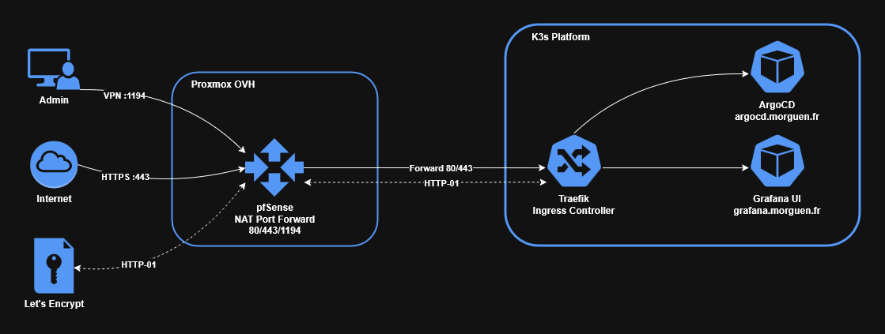
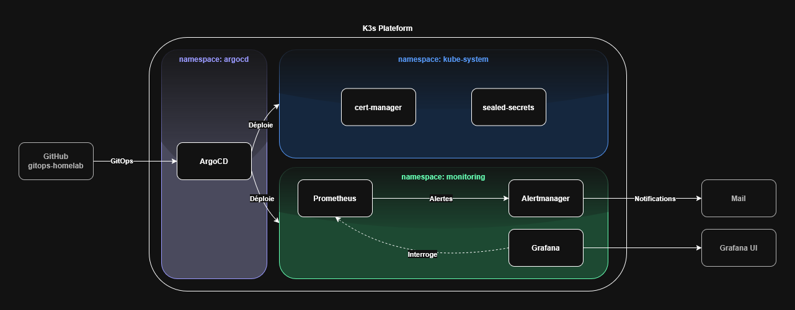

Ce document décrit les choix architecturaux et les composants de la stack. Pour l'installation voir [bootstrap.md](bootstrap.md), pour les problèmes rencontrés voir [troubleshooting.md](troubleshooting.md).
## I. Schémas de l'architecture de la plateforme :

**Diagramme des flux réseau au seins de la plateforme** :


**Diagramme applicatif de la plateforme** :


## II. Choix architecturaux :

### 1. Cluster `plateform` dédié :

**Cluster K3s** :

- Nom : `platform`
- Applicatifs : _Argo CD_ + _Prometheus_ + _Grafana_ + _Alertmanager_
- Gestion des secrets : _Sealed Secret_

➡️ **Séparation par responsabilité** : Mise en place d'un cluster dédié pour la plateforme de monitoring (`name: platform`). Le cluster peut être maintenu ou redémarré sans impact métier sur les autre cluster de l'infrastructure (environnement de test et production).

 **Argo CD** : 
 
- Outils de delivery, une fois les pods déployés il n'est plus dans la boucle.
- Peut se géré lui-même (pattern **App of Apps**)
- Une seule commande pour tout déployer/restaurer

➡️ _Argo CD_ détecte les fichiers dans _Git_ et déploie tout seul (y compris ses propres mises à jour). Idéal pour la reproductibilité et la résilience.
### 2. Dimensionnement du cluster :

Une seule node K3s :
- 2vCPU / 4Go de RAM pour _Argo CD_ + `kube-prometheus-stack` (_Prometheus_ + _Grafana_ + _Alertmanager_)
- Pas de HA mise en place sur le cluster

➡️ Pas de HA actuellement mise en place sur ce cluster. Le niveau d'impact d'un incident ne justifie pas la mise en place de HA dans ce projet particulier.

### 3. Gestion des secrets

Les secrets doivent exister dans le repo _Git_, en effet si on utilise un fichiers (ex. `vault.yaml`) pour les secrets et qu'on l'exclue dans un `.gitignore`, ce fichier n'existe que localement. _Argo CD_, qui clone le repo _GitHub_, ne voit que ce qui est commité ou pushé dans le repo, le fichier des secrets ne serait pas présent et la source de vérité serait incomplète.

_Comment décrire des données sensibles dans un fichier sur le repo ?_

_Sealed Secrets_ chiffre les secrets avec la clé publique du cluster, le fichier chiffré peut être commité publiquement dans Git. Seul le controller _Sealed Secrets_ du cluster possède la clé privée permettant de le déchiffrer au runtime.

➡️ _Sealed Secrets_ a été retenu plutôt qu'_External Secrets Operator_, ce dernier nécessitant un Vault externe qui serait une dépendance non justifiée à cette échelle.

### 4. Stack monitoring

- Utilisation de `kube-prometheus-stack`, cette stack offre les outils nécessaire à la mise en place de ce projet :
	- _Prometheus_ : Scrape les métriques de pods les _ServiceMonitors_ (CRD); évalue les règles d'alertes via _PrometheusRules_(CRD)
	- _Grafana_ : Visualisation des métriques et dashboards avec les informations renvoyées par _Prometheus_.
	- _Alertmanager_ : Permet de gérer les alertes; il reçoit les alertes de _Prometheus_ pour les router vers un service tier (Slack, mail, etc.)

➡️ `kube-prometheus-stack` est déployée via une umbrella chart _Helm_ qui embarque _Prometheus_, _Grafana_ et _Alertmanager_. Ce choix évite de gérer trois charts séparées et assure la cohérence des versions.
## III. Composants

### 1. [Argo CD](https://github.com/argoproj/argo-cd)

_Argo CD_ est l'outil GitOps du projet. Il surveille le repo _GitHub_ et synchronise automatiquement l'état du cluster avec ce qui est décrit dans _Git_.

>[!NOTE]
>_Argo CD_ utilise une pattern **App-of-Apps** : il définit une seule application racine qui orchestre plusieurs applications "enfants". Cette structure assure un versioning contrôlé de chaque environnement et composant dans _Git_, fournissant un modèle de déploiement propre, scalable et automatisé.

Une seule commande pour tout démarrer :

```bash
kubectl apply -f bootstrap/root-app.yaml
```

>[!NOTE]
>Si un incident se produit sur le cluster, la commande `kubectl apply -f bootstrap/root-app.yaml` sur un cluster K3s vierge suffit à tout restaurer.

**Structure Git du projet** :
```
gitops-homelab/
  ├── bootstrap/
  │   └── root-app.yaml              ← unique commande manuelle
  ├── apps/
  │   ├── monitoring-app.yaml        ← déploie kube-prometheus-stack
  │   └── argocd-app.yaml            ← Argo CD se gère lui-même
  └── platform/
      ├── argocd/
      │   ├── values.yaml
      │   └── cluster-issuer.yaml    ← ClusterIssuer Let's Encrypt
      └── monitoring/
          ├── values.yaml
          ├── grafana-sealed-secret.yaml
          └── alertmanager-sealed-secret.yaml
```

_Argo CD_ permet de décrire son auto-guérison (`selfHeal: true`) , ainsi tout changement manuel effectué sur le cluster est écrasé par _Argo CD_ à la prochaine synchronisation. La seule façon de modifier un élément est de le modifier sur Git.

[Lien vers la documentation.](https://argo-cd.readthedocs.io/en/stable/)

### 2. [kube-prometheus-stack](https://artifacthub.io/packages/helm/prometheus-community/kube-prometheus-stack)

**Composants de la stack** :

[**Prometheus**](https://prometheus.io/docs/introduction/overview/) - collecte et évalue :
- Scrape les métriques via `ServiceMonitors` (CRD)
- Évalue les règles d'alerte (`PrometheusRules` - CRD)

[**Alertmanager**](https://prometheus.io/docs/alerting/latest/alertmanager/) - achemine les alertes :
- Reçoit les alertes de _Prometheus_
- Applique la logique : grouping, silences, routing, horaires
- Envoie vers _Slack_ / mail / PagerDuty / webhook

[**Grafana**](https://grafana.com/docs/grafana/latest/) - visualise :
- Interroge _Prometheus_ pour afficher métriques et dashboards
- Couche de visualisation universelle (peut aussi interroger _Loki_, _Tempo_, _PostgreSQL_...)

**Flux complet** :
```
Prometheus détecte une anomalie sur le cluster
  │
  ├──► Alertmanager ──► Mail / Slack    (alerte)
  │
  └──► Grafana                          (visualisation)
```

**Évolutions futures possible** :

`kube-prometheus-stack` couvre le premier pilier de l'observabilité (métriques). Les logs (_Loki_) et le tracing (_Tempo_) sont prévus comme évolutions. _Grafana_ supporte nativement ces trois sources de données dans une vue unifiée.

```
Métriques  →  Prometheus  ┐
Logs       →  Loki        ├──►  Grafana (vue unifiée)
Traces     →  Tempo       ┘
```

- [**Loki**](https://grafana.com/docs/loki/latest/) : centralisation des logs, permettra de corréler une anomalie dans les métriques Prometheus avec les logs au même moment dans Grafana.
- [**Tempo**](https://grafana.com/docs/tempo/latest/) : Tracing distribué, permet de visualiser le cycle de vie d'une requête traversant un groupement d'applications.

### 3. [cert-manager](https://cert-manager.io/)

- _cert-manager_ est un opérateur Kubernetes, il se présente sous la forme d'un pod qui surveille ses propres CRDs et les Ingress annotés dans le but d'automatiser la gestion des certificats Let's Encrypt.
- Il travaille au niveau des objets Kubernetes et non au niveau infrastructure, ce qui le rend portable. Il aura, ainsi, le même comportement selon les cibles de déploiements.

Deux types d'objets permettent de définir l'autorité de certification :
- `ClusterIssuer` qui émet des certificats au niveau du cluster.
- `Issuer` qui émet des certificats au niveau du namespace.

Flux de certification :
```
Ingress avec annotation cert-manager.io/cluster-issuer
  └── cert-manager détecte l'annotation
        └── crée un Certificate object
              └── challenge HTTP-01 via Traefik
                    └── Let's Encrypt valide le domaine
                          └── certificat stocké dans un Secret
                                └── Traefik sert le HTTPS
```

>[!CAUTION]
>**Prérequis réseau** : le challenge HTTP-01 nécessite que le port 80 soit accessible depuis internet. Dans cette infra (Proxmox → pfSense → K3s), deux niveaux de NAT sont nécessaires :
> - **Proxmox** : règles iptables DNAT port 80/443 → IP pfSense
> - **pfSense** : Port Forward 80/443 → IP node K3s

>[!CAUTION]
>Le `ClusterIssuer` doit être dans Git. Faire attention à la création du `ClusterIssuer` avec un heredoc bash sans le commiter dans Git. Si le cluster est recréé, l'objet est perdu.

[Lien vers la documentation.](https://cert-manager.io/docs/)

### 4. [Sealed Secrets](https://github.com/bitnami-labs/sealed-secrets)

- Côté cluster : il est un controller / operator Kubernetes.
- Côté client : il offre un utilitaire : `kubeseal`.

`kubeseal` utilise un chiffrement asymétrique pour chiffrer les secrets qui peuvent être déchiffrés uniquement par le controller.

Les secrets chiffrés sont ensuite encodés dans une ressource : `SealedSecret`.

Création d'un secrets avec _Sealed Secrets_

1. Créer le secret en clair (temporaire, jamais commité)
2. Chiffrer avec kubeseal
3. Supprimer le fichier en clair
4. Référencer le SealedSecret dans le manifest (value.yaml)


>[!CAUTION]
> Tout changement de credentials doit passer par Git et jamais directement depuis la GUI (ex. changement de mot de passe administrateur _Grafana_), l'auto guérison d'Argo CD écraserait tout changements manuel.

[Lien vers la documentation.](https://github.com/bitnami-labs/sealed-secrets/blob/main/docs/developer/README.md)

### 5. Structure logique k8s

- _Helm_ génère les manifests Kubernetes à partir des `values.yaml`.
- 1 applicatif par pod : _Helm_ déploie chaque programme dans son propre pod.
- 1 seule chart _Helm_ qui embarque la stack d'observabilité.

_Exemple de structure_ :
```bash
Deployment "argocd-server"    →  Pod  →  Conteneur : argocd-server
Deployment "grafana"          →  Pod  →  Conteneur : grafana
StatefulSet "prometheus"      →  Pod  →  Conteneur : prometheus
StatefulSet "alertmanager"    →  Pod  →  Conteneur : alertmanager
```

- Les services assurent la communication entre les pods et vers l'extérieur :

**Communication** :
```bash
Pod vers pod : ClusterIP
Admin vers UIs : NodePort/Ingress
```

Communication interne _Grafana_ vers _Prometheus_ :
DNS : `http://prometheus-operated.monitoring.svc.cluster.local:9090`