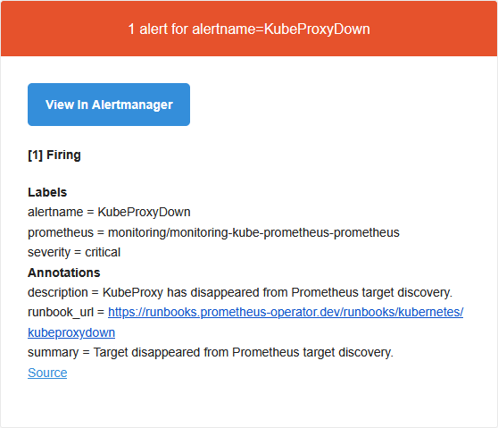

## I. Troubleshooting : Argo CD

**Erreur : `metadata.annotations: Too long: may not be more than 262144 bytes`**

Sans `ServerSideApply=true` les CRDs de _kube-prometheus-stack_ échouent avec l'erreur `metadata.annotations: Too long: may not be more than 262144 bytes`. C'est une limitation de Kubernetes sur la taille des annotations en `ClientSideApply`.

**Solution** : Editer le fichier `monitoring-app.yaml` et ajouter `ServerSideApply=true`

```yaml
    syncOptions:
      - CreateNamespace=true
      - ServerSideApply=true
```

---

**Erreur : Les secrets ne sont pas appliqués automatiquement**

L'`Application` doit déclarer `path: platform/monitoring` pour que _Argo CD_ déploie aussi les _SealedSecrets_ du dossier. Sans ça, les secrets doivent être appliqués manuellement avec `kubectl apply`.

---

**Erreur : les configuration effectués directement dans l'application via l'interface web ne sont pas gardées**

Attention au modifications dans les GUI des applicatifs et manuel sans commiter dans K3s. _Argo CD_ gère les déploiement, tout déploiement manuel depuis K3s se verra écrasé par ce qui est écrit dans le repo Git.

## II. Troubleshooting cert-manager

**Erreur : les commandes de vérifications affichent `False`, `Pending` et/ou `Connection refused`**

```bash
kubectl get certificate -n monitoring -w # Affiche False
kubectl get challenges -n monitoring -w # Affiche Pending indéfiniment
```

```bash
curl -v http://grafana.<nomDeDomaine>.fr/.well-known/acme-challenge/test # Affiche Connection refused
```

Il est possible qu'il y ait un problème de routage du trafic causé par un **hairpin NAT**. Dans ce cas il faut :

- Editer le _CoreDNS_ :

```bash
kubectl edit configmap coredns -n kube-system
```

- Ajouter les entrées désirées dans la partie `NodeHosts` :

```yaml
NodeHosts: |
    <ipK3s> grafana.<nomDeDomaine>.fr
    <ipK3s> argocd.<nomDeDomaine>.fr
```

- Pour que cette configuration ne soit pas écrasée au redémarrage de K3s, il faut la rendre persistante :

```bash
sudo nano /var/lib/rancher/k3s/server/manifests/coredns-custom.yaml
```

```yaml
apiVersion: v1
kind: ConfigMap
metadata:
  name: coredns
  namespace: kube-system
data:
  NodeHosts: |
    <ipK3s> <nomK3s>
    <ipK3s> grafana.<nomDeDomaine>.fr
    <ipK3s> argocd.<nomDeDomaine>.fr
```

---

**Erreur : `email has forbidden domain "example.com"`**

Le `ClusterIssuer` contient encore le placeholder `email@example.com`. Let's Encrypt refuse d'enregistrer un compte ACME avec ce domaine.

Pour détecter l'erreur :

```bash
kubectl describe clusterissuer letsencrypt-prod
```

Ou :

```bash
kubectl logs -n cert-manager deployment/cert-manager | grep "failed to register"
```

**Solution** : corriger l'email dans `platform/argocd/cluster-issuer.yaml` puis appliquer manuellement (le `ClusterIssuer` n'est pas géré par _Argo CD_) :

```bash
kubectl apply -f platform/argocd/cluster-issuer.yaml
kubectl delete secret letsencrypt-prod -n cert-manager
```

---

**Erreur : `Account ID doesn't match ID for authorization`**

Se produit après suppression du secret ACME `letsencrypt-prod`, un nouveau compte est créé mais les `Orders` existantes référencent l'ancien. Un nettoyage complet est nécessaire :

```bash
kubectl delete certificate grafana-tls -n monitoring
kubectl delete secret letsencrypt-prod -n cert-manager
```

_cert-manager_ recrée automatiquement le certificat via l'`ingress-shim`, et repart avec un compte ACME cohérent.

## III. Troubleshooting : Alertmanager

**Erreur : Les mail ne sont pas reçus par le destinataire**

_kube-prometheus-stack_ merge la configuration _Alertmanager_ avec ses défauts. Si la configuration est incomplète (`receivers` ou `inhibit_rules` manquants), celle par défaut prend le dessus; l'`email` du destinataire disparaît et tout est routé vers `null`.

**Solution** : Fournir la configuration complète `inhibit_rules`, tous les `receivers` (`null` + `email`), et la route `Watchdog`.

---
### Débogage d'Alertmanager

- Si une configuration _Alertmanager_ présente des problèmes et doit être mise à jour ou débuggée :

- Vérifier la config réellement chargée

```bash
kubectl get secret alertmanager-monitoring-kube-prometheus-alertmanager \
  -n monitoring \
  -o jsonpath="{.data.alertmanager\.yaml}" | base64 -d
```

- Vérifier les alertes actives et leurs receivers

```bash
kubectl port-forward svc/monitoring-kube-prometheus-alertmanager \
  -n monitoring 9093:9093 &
curl http://localhost:9093/api/v2/alerts | python3 -m json.tool
```

- Vérifier que le secret est bien monté

```bash
kubectl exec -n monitoring \
  alertmanager-monitoring-kube-prometheus-alertmanager-0 \
  -c alertmanager -- \
  ls /etc/alertmanager/secrets/
```

- Forcer le redémarrage (`StatefulSet` ne redémarre pas automatiquement)

```bash
kubectl rollout restart statefulset \
  alertmanager-monitoring-kube-prometheus-alertmanager \
  -n monitoring
```  

>[!WARNING]
>**StatefulSets vs Deployments** : un `StatefulSet` (_Prometheus_, _Alertmanager_) ne redémarre pas automatiquement quand un secret change, contrairement à un `Deployment`. Il faut forcer le rollout manuellement.

---
**Erreur : Réception d'alertes perpétuelles = `KubeControllerManagerDown`, `KubeSchedulerDown` et `kubeProxyDown`**

Faux positifs inhérents à K3s, ces composants sont intégrés dans le binaire et ne sont pas exposés comme endpoints _Prometheus_.

_Exemple d'une alerte reçue sur gmail :_



**Solution** : Voir [bootstrap.md section 5.3](./bootstrap.md#53-exclusion-des-composants-intégrés-à-k3s).
### Commandes utiles :

Verifier qu'_Alertmanager_ est `Running` :

```bash
kubectl get pods -n monitoring | grep alertmanager
```

Tester une alerte :

```bash
sleep 2 && curl -X POST http://localhost:9093/api/v2/alerts \
  -H "Content-Type: application/json" \
  -d '[{"labels":{"alertname":"TestAlert","severity":"warning"}}]'
```

## IV. Point de vigilance généraux 

### heredoc bash : anti-pattern GitOps

```bash
cat <<EOF | kubectl apply -f -
# contenu yaml
EOF
```

Le heredoc crée un objet dans le cluster sans laisser de trace dans _Git_. Si le cluster est recréé, l'objet est perdu. **Tout objet créé manuellement doit être commité dans _Git_.**

### Forcer un sync ArgoCD

- Via `kubectl` :

```bash
kubectl annotate application monitoring \
  -n argocd \
  argocd.argoproj.io/refresh=hard
```

- Via UI : 

```text
Application → Sync → Synchronize
```

### Port-forward : usage et limites

- Tunnel temporaire vers un service interne :

```bash
kubectl port-forward svc/mon-service -n namespace 8080:8080 &
```

- Si le port est déjà utilisé :

```bash
pkill -f "port-forward"
```

- Vérifier que le port est libéré :

```bash
ss -tlnp | grep <numeroDePort>
```

